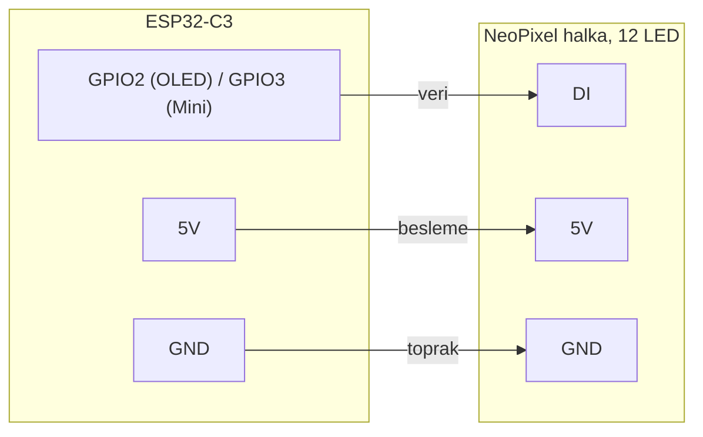

# Lava.-Biolight
Biolight, gün ışığının ritmini evine taşıyan bir aydınlatmadır. Sabah ferah, akşam sıcak ve loş bir ışıkla vücudunun doğal saatine eşlik eder.

İnternet sayfamdan ürün hakkında daha çok bilgi alabilirsiniz
https://burapist97.github.io/Lava.-Biolight/
# Biolight

**Sirkadiyen aydınlatma.** Bir LAVA. ürünü.

Biolight, 12 LED'li bir NeoPixel halkayla gün ışığının ritmini ve gökyüzünü odaya taşıyan bir ESP32-C3 aydınlatma projesidir. Bulunduğu şehrin gerçek gün doğumu ve gün batımı saatlerini izler; sabah ferah, akşam sıcak ve loş bir ışık verir. Dışarıda yağmur yağdığında ya da bulutlar geçtiğinde halka da bunu yansıtır.

Cihaz kendi web sunucusunu barındırır. Kurulum ve kontrol telefonun tarayıcısından yapılır; uygulama indirmek gerekmez.

**[İnteraktif kullanım kılavuzunu aç](https://burapist97.github.io/biolight/)** · **[Teknik kılavuz (PDF)](docs/Biolight_Teknik_Kilavuz.pdf)**

---

## Özellikler

- **Sirkadiyen mod:** Renk sıcaklığı ve parlaklık gün boyunca değişir. Şafakta 2200 K'den başlar, öğlen 6200 K'ye çıkar, akşam yeniden ısınır, gece mum ışığına döner.
- **Gökyüzü efektleri:** OpenWeather verisine göre güneşli, parçalı bulutlu, bulutlu, sisli, yağmur, sağanak ve şimşek, kar. Bulutlar rüzgâr hızına göre akar.
- **Serbest modlar:** Mum, sabit renk, gökkuşağı, renk akışı, renk geçişi, nefes.
- **Zamanlama:** Günlük en fazla 10 kural; örneğin 07:00 Sirkadiyen, 22:30 Mum, 00:30 Kapalı.
- **Telefonla kurulum:** `LAVA_Setup` ağına bağlanınca kurulum sayfası kendiliğinden açılır. Ağ, şehir ve oda adı seçilir, halka her adımı ışıkla gösterir.
- **Birden fazla ışık:** Aynı ağdaki Biolight'lar birbirini bulur. Her birine oda adı verilir, paneldeki sekmelerle aralarında geçilir, istenenler birlikte çalışır.
- **Kesintiye dayanıklı:** Ayarlar kalıcı bellekte saklanır. Elektrik kesintisinden sonra modem geç açılsa bile cihaz ağa kendiliğinden döner.
- **Wi-Fi sıfırlama:** BOOT düğmesine 5 saniye basılı tutmak yeterli.

## Donanım

Projede yalnızca iki parça var; araya başka bir elektronik eleman girmez.

| Parça | Adet |
| --- | --- |
| ESP32-C3 OLED geliştirme kartı **veya** ESP32-C3 Mini | 1 |
| WS2812B NeoPixel halka, 12 LED | 1 |
| USB-C kablo ve 5 V adaptör (en az 1 A, önerilen 2 A) | 1 |

### Bağlantı

| Kart pini | Halka ucu |
| --- | --- |
| GPIO2 (ESP32-C3 OLED) veya GPIO3 (ESP32-C3 Mini) | DI |
| 5V | 5V / VCC |
| GND | GND |



> [!IMPORTANT]
> **ESP32-C3 Mini** kullanıyorsan veri kablosunu **GPIO3**'e bağla ve `Biolight.ino` içindeki satırı `#define LED_PIN 3` yap. Mini kartta GPIO2 kullanılırsa kart açılırken hataya girer.

Halkanın 5V ucunu kartın 3V3 pinine değil, 5V pinine bağla. Yazılım halkanın akımını 600 mA ile sınırlar.

## Kurulum

### 1. OpenWeather API anahtarı al

Depoda API anahtarı bulunmaz; kendi anahtarını eklemen gerekir.

1. [openweathermap.org](https://openweathermap.org) adresinde ücretsiz bir hesap aç.
2. [My API keys](https://home.openweathermap.org/api_keys) sayfasından anahtarını kopyala.
3. `Biolight/Biolight.ino` dosyasındaki satıra yapıştır:

```cpp
const char* OWM_API_KEY = "BURAYA_API_ANAHTARINI_YAZ";
```

Yeni bir anahtarın etkinleşmesi biraz zaman alabilir. Anahtar girilmezse cihaz yine çalışır, ancak hava durumu alınamaz ve gün doğumu ile gün batımı için varsayılan saatler kullanılır.

> [!WARNING]
> Anahtarını içeren kodu herkese açık bir depoya gönderme. Açığa çıkarsa My API keys sayfasından silip yenisini oluştur.

### 2. Arduino IDE'yi hazırla

1. **Dosya → Tercihler → Ek Kart Yöneticisi URL'leri** alanına şunu ekle:
   ```
   https://espressif.github.io/arduino-esp32/package_esp32_index.json
   ```
2. **Kart Yöneticisi**'nden `esp32 by Espressif Systems` paketini kur.
3. **Kütüphane Yöneticisi**'nden şunları kur:
   - `ArduinoJson` (7.x)
   - `Adafruit NeoPixel`

### 3. Kart ayarları

| Ayar | Değer |
| --- | --- |
| Kart | ESP32C3 Dev Module |
| USB CDC On Boot | Enabled |
| CPU Frequency | 160 MHz |
| Flash Size | 4MB (32Mb) |
| Partition Scheme | Minimal SPIFFS (1.9MB APP with OTA) |
| Flash Mode | QIO (`invalid header` hatasında DIO) |
| Upload Speed | 921600 |

### 4. Yükle

`Biolight` klasöründeki `Biolight.ino` dosyasını aç, kartına göre `LED_PIN` değerini kontrol et ve **Yükle**'ye bas. Yükleme "Connecting..." aşamasında takılırsa BOOT düğmesine basılı tutarak USB kablosunu tak.

Proje Arduino IDE 1.8.57 ve ESP32 kart paketi 3.3.11 ile test edildi.

## İlk kullanım

1. Biolight'ı fişe tak. Halka kehribar renkte yavaşça nefes alır.
2. Telefonunla **LAVA_Setup** ağına bağlan. Kurulum sayfası kendiliğinden açılır; açılmazsa tarayıcıya `192.168.4.1` yaz.
3. Evinin Wi-Fi ağını seç, şehrini ve ışığın oda adını gir, **Bağlan**'a dokun.
4. **Kurulumu tamamla**'ya dokun. Telefonun ev ağına döner ve kontrol paneli açılır.

Kontrol paneline sonradan aynı Wi-Fi ağındayken **http://biolight.local** adresinden ulaşılır.

### Halkanın dili

| Halka | Anlamı |
| --- | --- |
| Kehribar, yavaşça nefes alıyor | Kurulum bekleniyor |
| Halkada dönen ışık | Wi-Fi ağına bağlanıyor |
| Halkayı dolduran sıcak beyaz | Bağlandı, hazır |
| İki kızıl nabız | Bağlantı kurulamadı, şifreyi kontrol et |
| Kızıl renkle dolan halka | BOOT basılı, Wi-Fi sıfırlanıyor |

## Proje yapısı

```
Biolight/
├── Biolight.ino   Ana program: efektler, sirkadiyen hesap, hava durumu, kurulum, web API, çoklu cihaz
├── tipler.h       Veri türleri (Arduino IDE uyumluluğu için ayrı dosyada)
├── arayuz.h       Kontrol paneli (HTML, CSS, JavaScript)
└── kurulum.h      İlk kurulum sayfası
docs/
└── Biolight_Teknik_Kilavuz.pdf
index.html         İnteraktif kullanım kılavuzu (GitHub Pages)
```

## Web API

Kontrol paneli cihazla JSON üzerinden konuşur. Aynı uçlar ev otomasyonu entegrasyonları için de kullanılabilir.

| Yöntem | Yol | Ne yapar |
| --- | --- | --- |
| GET | `/api/state` | Ayarlar, saat, evre, hava, zamanlama ve diğer cihazlar |
| POST | `/api/set` | `pwr`, `mode`, `bri`, `spd`, `wfx`, `c`, `sched`, `preview`, `name`, `sync` alanlarını günceller |
| POST | `/api/sched` | Zamanlama kurallarını değiştirir |
| POST | `/api/city` | Şehri değiştirir ve hava durumunu yeniler |
| POST | `/api/wifireset` | Wi-Fi bilgilerini siler ve yeniden başlatır |

Örnek: ışığı mum moduna almak

```bash
curl -X POST http://biolight.local/api/set \
  -H "Content-Type: application/json" \
  -d '{"mode":"mum","bri":160}'
```

Tüm uçlar, sabitler ve yazılımın çalışma mantığı [teknik kılavuzda](docs/Biolight_Teknik_Kilavuz.pdf) anlatılıyor.

## Sorun giderme

| Belirti | Çözüm |
| --- | --- |
| ESP32-C3 Mini açılışta hataya giriyor | Veri kablosunu GPIO3'e taşı, `LED_PIN` değerini 3 yap |
| `This chip is ESP32-C3, not ESP32` | Kartı ESP32C3 Dev Module seç |
| `Sketch too big` | Partition Scheme: Minimal SPIFFS |
| Seri Monitör boş | USB CDC On Boot: Enabled |
| Panelde "API anahtarı girilmemiş" | `OWM_API_KEY` satırını doldurup yeniden yükle |
| LAVA_Setup ağı görünmüyor | BOOT düğmesine 5 saniye basılı tut |
| `biolight.local` açılmıyor | Kurulum ekranında gösterilen IP adresini kullan |

---

Biolight, bir **LAVA.** ürünüdür. Hava verisi [OpenWeather](https://openweathermap.org) tarafından sağlanır.
